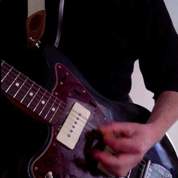

# Career

I tend to stay near the creative side of tech; the places exploring things that aren't well understood. I think of it as where you find the things that haven't changed society yet.

I have worked with [Harvard Law School](http://law.harvard.edu/), [Calypso](http://calypso.com/), Bear Stearns, which became [JPMorgan](http://www.jpmorgansecurities.com/), [Johns Hopkins](http://www.clsp.jhu.edu/), [The Robin Hood Foundation](http://www.robinhood.org/), EXFM, [Venmo](https://venmo.com/), [VHX](https://www.vhx.tv/), and at times I've consulted through my company, J2 Labs.

I have also been a startup investor / advisor for [Socratic](http://socratic.org/), [Sunrise](https://sunrise.am/) (acquired by Microsoft), [VHX](https://www.vhx.tv/) (acquired by Vimeo), [Lua](http://getlua.com/), [Thinglink](http://thinglink.com/), [Chromatik](https://www.chromatik.com/), and some others.

# Programming

I can program in a bunch of different languages. Lately it's been Python. Before that it was Swift, Obj-C, and Go.

I like writing open source software. I sometimes start open source projects too. Of all the projects I've started, [Schematics](https://github.com/schematics/schematics) is my favorite. I think of it as Python Data Structures for Humans. [Brubeck](https://github.com/j2labs/brubeck) is a concurrent server framework with strong opinions on [web serving](http://mongrel2.org/), [concurrency](http://gevent.org/), [data modeling](https://github.com/schematics/schematics), and [messaging](http://zeromq.org/). And [Micro Army](https://github.com/j2labs/microarmy) is a tool I made for testing Brubeck's performance. It works by instantiating a few hundred AWS Micros to flood some URL and report back the performance.

One of the more rewarding aspects of open source is learning where your work turns up. You've used some of my work if you play [QuizUp](https://www.quizup.com/), [https://www.quantopian.com/code trading algorithms on Quantopian](https://www.quantopian.com/), read [Huffington Post](http://www.huffingtonpost.com/), or wear [Warby Parker](https://www.warbyparker.com/) sunglasses.

I also have a computer science degree from [Northeastern University](http://www.ccs.neu.edu/). And I was in the first batch of [Recurse Center](https://www.recurse.com/), formerly known as _Hacker School_.

# Other

I've played in bands for most of my life. I wrote a brief history of it [here](/music).

I currently help organize [Brooklyn Swift](http://www.meetup.com/Brooklyn-Swift-Developers/). In the past I organized both Hack && Tell and Dumbo Tech Breakfast.

Music and tech are most of what I think about, but I also make time to read business books, watch meet the press, listen to design podcasts, and explore things I don't know much about. I hope to build a house one day, too.

