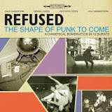
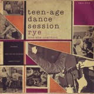
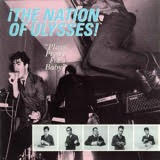

I've been listening to [Refused - Freedom](https://open.spotify.com/album/5v1nEWLED30iSsHfkrF34f) a lot. I tried to avoid forming any real opinions until I had listened to it a few times. I'm now at a point where I love the record.

I had to think through some things and pull back some of the pressure of trying to follow up The Shape Of Punk To Come to get there. They were kids when they put that record out. Kids just trying to have fun and not thinking too hard about what they did, which is surely why the record feels like a work of genius.

Above all, I think the kids from Sweden were trying to reach out to the international hardcore community and say, "hey! we're here and we're part of this too!" and because the Internet was just starting to become a thing people cared about, they got something right and everyone told everyone and the record became a huge deal.

Let's explore where it came from!

First, the album cover. Refused's references [Rye Coalition's Teen-age Dance Session](https://www.youtube.com/watch?v=s6QQcwpe-uA).

Next, the song Refused Are Fucking Dead is a reference to Born Against's [Born Against Are Fucking Dead](https://www.youtube.com/watch?v=jp4W7PwjDNw).

The album's title The Shape Of Punk To Come is often said to be a reference to Ornette Coleman's The Shape Of Jazz To Come, which is true, but they got there by way of Nation Of Ulysses!'s Plays Pretty For Baby, which had a song called [The Sound Of Jazz To Come](https://www.youtube.com/watch?v=wS34qkE-Kqo) on it. And let's take a look at the album cover, because you see the band wearing suits and ties, something Refused have been known to wear on stage too.

The last two lines lines of the lyrics to Nation's Sound Of Jazz could probably describe Refused's worldview at the time: They refused to be patronized or dismissed, turned into a cult or giggled at. The important thing was to build a social analysis that would encompass modern culture and make humankind reckon with it.

So, today when I listen to Refused's latest record, Freedom, I can't help but feel like they were thrust into the limelight for little more than trying to make a record that says they belong in the hardcore scene too. These kids from Sweden, nowhere close to where their idols were from, and arguably in the wrong time period too, were channeling their heroes and, almost by accident, they altered the shape of punk to come by channeling all the punk that had come before them.

To me, it's straight-up unfair to put the pressure of their masterpiece on the follow-up. Knowing enough about where the masterpiece came from helps me pull back that pressure and now I loooooveeeee the new record.

I saw them play twice a month ago. First at Bowery Ballroom and then at St Vitus. I found the St Vitus show on youtube, and just like when they were kids, they started out with some love for the bands that came before them by opening the set with Fugazi's Bed For The Scraping: https://www.youtube.com/watch?v=FkfeY_rRg38
